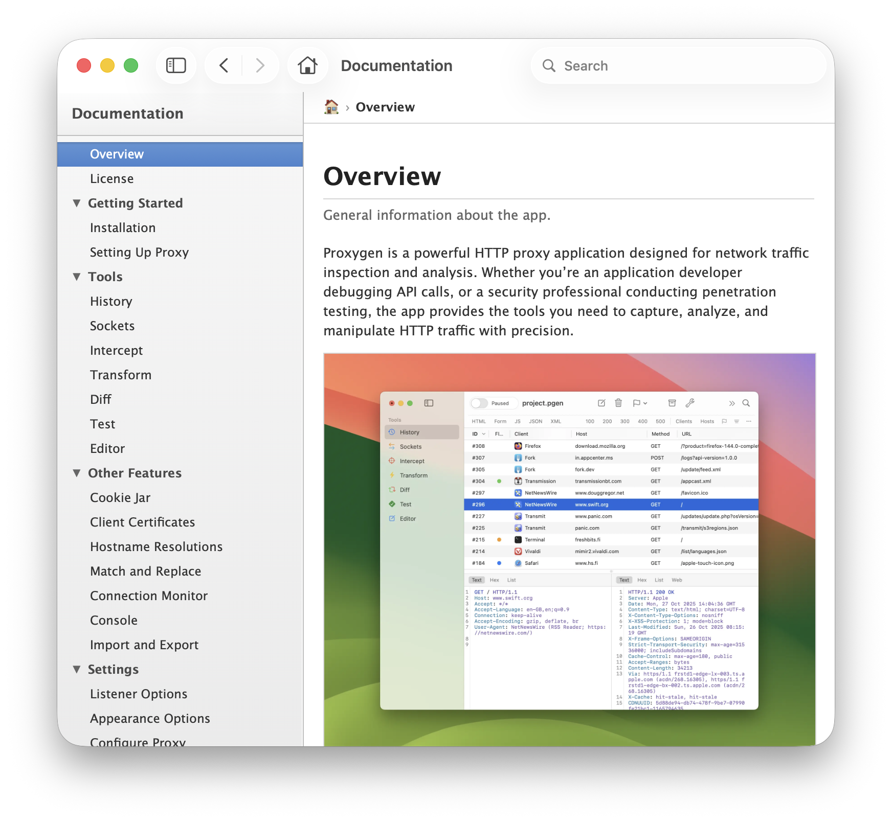

# HelpBooks

A native macOS application and command-line tool for creating Apple Help Books from [Hugo](https://gohugo.io/) documentation. Transform your Hugo-based documentation into native macOS Help Books with a modern, SwiftUI-based interface.

## Features

- 📝 **Hugo Compatible** - Works with Hugo's frontmatter format and content structure
- 🎨 **Live Preview** - See your help content rendered in real-time with full dark mode support
- 📁 **Hugo-style Organization** - Supports content organization with `_index.md` files for sections
- 🔍 **Search Integration** - Automatically generates search indexes for macOS Help Viewer
- 🎯 **Weight-based Ordering** - Control the order of pages and sections using frontmatter weights
- 🖼️ **Asset Management** - Import and manage images, CSS, and other assets via drag-and-drop
- 🚀 **Export Ready** - Generates complete `.help` bundles ready to add to your Xcode project
- 🌓 **Dark Mode Support** - Full support for macOS light and dark appearances
- 🎨 **Multiple Themes** - Choose from Modern, Mavericks, or Tiger styling
- ⚡ **Lotus Docs Alert Boxes** - Support for [Lotus Docs](https://lotusdocs.dev/) style alert shortcodes

## Screenshots

### Preview tool


### Help Book in Maverics theme



## Installation

### Requirements

- macOS 14.0 or later
- Xcode 15 or later (for building from source)

### Building from Source

```bash
git clone https://github.com/yourusername/HelpBooks.git
cd HelpBooks
swift build -c release
```

The built application will be in `.build/release/HelpBooks`.

## Usage

### HelpBooks GUI App

1. **Import Hugo Content**
   - Launch the HelpBooks app
   - Drag and drop your Hugo content folder (containing `.md` files with YAML frontmatter)
   - Optionally drag and drop an assets folder with images and other resources to the Assets section

2. **Preview & Edit**
   - Browse your content in the sidebar
   - Preview pages with live rendering
   - Select different themes from the Style menu
   - Edit metadata in the Metadata Editor

3. **Export**
   - Click "Export Help Book"
   - Choose an output location
   - The app generates a complete `.help` bundle

### Content Structure

HelpBooks expects your Hugo content to follow this structure:

```
content/
├── _index.md          # Optional: root metadata
├── getting-started/
│   ├── _index.md      # Section metadata (title, description, weight)
│   ├── installation.md
│   └── quick-start.md
├── guides/
│   ├── _index.md
│   ├── basic-usage.md
│   └── advanced-features.md
└── overview.md
```

### Frontmatter (Hugo Format)

Each Markdown file should include YAML frontmatter in Hugo's format:

```yaml
---
weight: 100
title: "Getting Started"
description: "Learn the basics of using the app."
keywords: ["tutorial", "guide", "basics"]
---

# Getting Started

Your content here...
```

**Frontmatter Fields:**

- `title` - Page or section title (required)
- `description` - Brief description shown as subtitle
- `weight` - Sort order (lower numbers appear first)
- `keywords` - Array of keywords for search indexing
- `draft` - Set to `true` to exclude from export

### Section Metadata (_index.md)

Use `_index.md` files to define metadata for folders/sections:

```yaml
---
weight: 100
title: "User Guide"
description: "Complete guide to using the application."
---
```

Files starting with underscore are not included as separate pages, only their metadata is used.

### Shortcodes (Lotus Docs Alert Boxes)

HelpBooks supports [Lotus Docs](https://lotusdocs.dev/) style alert boxes using Hugo shortcode syntax:

```markdown



```

**Supported contexts:** `info`, `primary`, `warning`, `danger`, `success`, `light`, `dark`

These alert boxes are compatible with Lotus Docs theme syntax, making it easy to maintain documentation that works both as a Hugo site and as macOS Help.

## Themes and Styling

HelpBooks offers three built-in themes that match different macOS design eras:

### Modern (Default)
- Contemporary macOS design language
- San Francisco font system
- Clean, minimal interface with generous whitespace
- Full dark mode support with system colors
- Best for apps targeting macOS 11 (Big Sur) and later

### Mavericks
- OS X 10.9 Mavericks era styling (2013-2014)
- Lucida Grande font
- Classic macOS appearance with subtle gradients
- Full dark mode support
- Ideal for apps maintaining compatibility with older macOS versions

### Tiger
- OS X 10.4 Tiger era styling (2005-2007)
- Geneva/Lucida Grande fonts
- Classic Aqua-inspired interface
- Full dark mode support
- Perfect for retro-styled applications or nostalgia

### Selecting a Theme

**In the GUI App:**
- Select your theme from the "Style" dropdown in the Metadata Editor
- Preview updates immediately to show the selected theme
- Theme is saved with your project and applied on export

**In the CLI Tool:**
- Set the `theme` field in your `helpbooks.json` configuration file
- Valid values: `modern`, `mavericks`, `tiger`
- See the CLI Configuration section below for details

All themes support:
- Responsive layouts that prevent horizontal scrolling
- Full light and dark mode support
- Proper rendering of alert boxes, code blocks, and tables
- Collapsible table of contents navigation

## Integration with Your macOS App

After exporting your Help Book:

1. **Add to Xcode Project**
   - Drag the `.help` bundle into your Xcode project
   - Make sure it's added to "Copy Bundle Resources"

2. **Update Info.plist**

   Add these keys to your app's `Info.plist`:

   ```xml
   <key>CFBundleHelpBookFolder</key>
   <string>YourApp.help</string>
   <key>CFBundleHelpBookName</key>
   <string>com.yourcompany.yourapp.help</string>
   ```

3. **Build and Run**

   Your help book will automatically appear in the Help menu.

## Command-Line Tool (helpbooks)

The CLI tool provides automation capabilities:

```bash
# Create or edit a configuration file
helpbooks config

# Generate Help Book from configuration
helpbooks generate

# Generate with custom paths
helpbooks generate --content ./docs --output ./build

# Use custom config file
helpbooks generate -c myconfig.json
```

### CLI Commands

```
USAGE: helpbooks <command> [options]

COMMANDS:
  config              Create a configuration file interactively
  generate            Generate Help Book from configuration
  help                Show help message
  version             Show version information

CONFIG OPTIONS:
  -c, --config <path>     Path to config file (default: helpbooks.json)

GENERATE OPTIONS:
  -c, --config <path>     Path to config file (default: helpbooks.json)
  --content <path>        Override content folder path
  --assets <path>         Override assets folder path
  --custom-css <path>     Override with custom CSS file (replaces theme)
  -o, --output <path>     Override output folder path
```

### CLI Configuration File

The `helpbooks.json` configuration file supports the following fields:

```json
{
  "helpBookTitle": "My App Help",
  "helpBookIdentifier": "com.company.myapp.help",
  "helpBookVersion": "1.0",
  "contentDirectory": "./content",
  "assetsDirectory": "./assets",
  "outputDirectory": "./build",
  "theme": "modern",
  "customCssPath": "./custom-style.css"
}
```

**Configuration Fields:**

- `helpBookTitle` - The title of your help book (appears in the sidebar header)
- `helpBookIdentifier` - Unique bundle identifier (should match your Info.plist)
- `helpBookVersion` - Version string for the help book
- `contentDirectory` - Path to folder containing Markdown files
- `assetsDirectory` - Path to folder containing images and other assets (optional)
- `outputDirectory` - Path where the `.help` bundle will be generated
- `theme` - Visual theme for the help book: `Modern`, `Mavericks`, `Tiger`, or `Custom` (default: `Modern`)
- `customCssPath` - Path to a custom CSS file (required when theme is `Custom`)

**Interactive Configuration:**

Run `helpbooks config` to create or update a configuration file interactively. The wizard will:
- Show previous values in brackets (e.g., `[./content]`)
- Press Enter to keep the previous value
- Offer theme options including "Custom" for custom CSS
- Only prompt for CSS file path when "Custom" theme is selected

### Custom CSS Styling

You can completely customize the appearance of your Help Book by providing your own CSS file:

**Using the CLI:**
```bash
# In your config file - set theme to "Custom"
{
  "theme": "Custom",
  "customCssPath": "./my-custom-styles.css"
}

# Or via command line
helpbooks generate --custom-css ./my-custom-styles.css

# Or use the interactive wizard - choose option 4 for Custom theme
helpbooks config
```

When theme is set to `Custom` or a custom CSS file is specified via command line, it completely replaces the built-in theme CSS, giving you full control over the styling. Your CSS file will be copied to the Help Book bundle as `style.css`.

## Project Architecture

```
HelpBooks/
├── Models/              # Data models (MarkdownDocument, HelpProject, etc.)
├── ViewModels/          # View logic and state management
├── Views/               # SwiftUI views
├── Services/
│   ├── FileSystem/      # File import and scanning
│   ├── MarkdownProcessor/  # Markdown parsing and frontmatter
│   └── HelpBookGenerator/  # Help Book export logic
└── Assets/              # App resources
```

## Features in Detail

### Dark Mode Support

All preview content automatically adapts to system appearance:
- Dark backgrounds and light text in dark mode
- Light backgrounds and dark text in light mode
- Alert boxes and code blocks with proper contrast

### Weight-Based Sorting

Control the order of pages and sections using the `weight` field:
- Lower weights appear first
- Items without weights appear last
- Files and folders can be mixed in any order based on weight

### Asset Management

- Automatically detects and copies images, CSS, and JavaScript files
- Rewrites asset paths to work correctly in the Help Book bundle
- Supports both absolute and relative paths in Markdown

## Contributing

Contributions are welcome! Please feel free to submit a Pull Request.

## License

MIT License

Copyright (c) 2025

Permission is hereby granted, free of charge, to any person obtaining a copy
of this software and associated documentation files (the "Software"), to deal
in the Software without restriction, including without limitation the rights
to use, copy, modify, merge, publish, distribute, sublicense, and/or sell
copies of the Software, and to permit persons to whom the Software is
furnished to do so, subject to the following conditions:

The above copyright notice and this permission notice shall be included in all
copies or substantial portions of the Software.

THE SOFTWARE IS PROVIDED "AS IS", WITHOUT WARRANTY OF ANY KIND, EXPRESS OR
IMPLIED, INCLUDING BUT NOT LIMITED TO THE WARRANTIES OF MERCHANTABILITY,
FITNESS FOR A PARTICULAR PURPOSE AND NONINFRINGEMENT. IN NO EVENT SHALL THE
AUTHORS OR COPYRIGHT HOLDERS BE LIABLE FOR ANY CLAIM, DAMAGES OR OTHER
LIABILITY, WHETHER IN AN ACTION OF CONTRACT, TORT OR OTHERWISE, ARISING FROM,
OUT OF OR IN CONNECTION WITH THE SOFTWARE OR THE USE OR OTHER DEALINGS IN THE
SOFTWARE.

## Resources

- [Apple Help Programming Guide](https://developer.apple.com/library/archive/documentation/Carbon/Conceptual/ProvidingUserAssitAppleHelp/)
- [Hugo Documentation](https://gohugo.io/documentation/)
- [Lotus Docs Theme](https://lotusdocs.dev/) (for alert box syntax)
- [Markdown Guide](https://www.markdownguide.org/)
- [YAML Specification](https://yaml.org/)

## Support

For bug reports and feature requests, please use the [GitHub Issues](https://github.com/yourusername/HelpBooks/issues) page.
